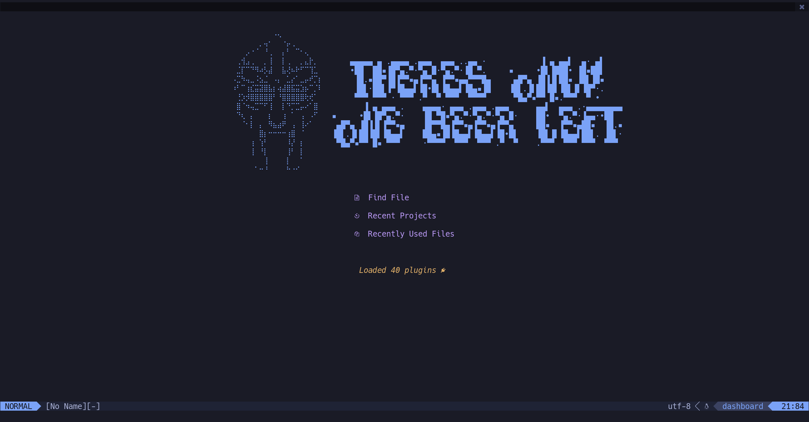

# Neovim Config

## Requirements

* [neovim](https://github.com/neovim/neovim) >= 0.5

## Plugins

  

    List
  

   
  <table>
    <thead>
      <tr>
        <th>Name</th>
        <th>Description</th>
      </tr>
    </thead>
    <tbody>
      <tr>
        <td><a href="https://github.com/wbthomason/packer.nvim">wbthomason/packer.nvim</a></td>
        <td>A use-package inspired plugin manager for Neovim.</td>
      </tr>
      <tr>
        <td><a href="https://github.com/rcarriga/nvim-notify">rcarriga/nvim-notify</a></td>
        <td>A fancy, configurable, notification manager for NeoVim</td>
      </tr>
      <tr>
        <td><a href="https://github.com/nvim-lua/plenary.nvim">nvim-lua/plenary.nvim</a></td>
        <td>plenary: full; complete; entire; absolute; unqualified. All the lua functions I don't want to write twice.
        </td>
      </tr>
      <tr>
        <td><a href="https://github.com/nvim-lua/popup.nvim">nvim-lua/popup.nvim</a></td>
        <td>[WIP] An implementation of the Popup API from vim in Neovim. Hope to upstream when complete</td>
      </tr>
      <tr>
        <td><a href="https://github.com/folke/lua-dev">folke/lua-dev.nvim</a></td>
        <td>Dev setup for init.lua and plugin development with full signature help, docs and completion for the nvim lua
          API.</td>
      </tr>
      <tr>
        <td><a href="https://github.com/kyazdani42/nvim-web-devicons">kyazdani42/nvim-web-devicons</a></td>
        <td>lua <code>fork</code> of vim-web-devicons for neovim</td>
      </tr>
      <tr>
        <td><a href="https://github.com/kyazdani42/nvim-tree.lua">kyazdani42/nvim-tree.lua</a></td>
        <td>A file explorer tree for neovim written in lua</td>
      </tr>
      <tr>
        <td><a href="https://github.com/folke/which-key.nvim">folke/which-key.nvim</a></td>
        <td>Create key bindings that stick. WhichKey is a lua plugin for Neovim 0.5 that displays a popup with possible
          keybindings of the command you started typing.</td>
      </tr>
      <tr>
        <td><a href="https://github.com/neovim/nvim-lspconfig">neovim/nvim-lspconfig</a></td>
        <td>Quickstart configurations for the Nvim LSP client</td>
      </tr>
      <tr>
        <td><a href="https://github.com/kabouzeid/nvim-lspinstall">kabouzeid/nvim-lspinstall</a></td>
        <td>Install LSP Servers</td>
      </tr>
      <tr>
        <td><a href="https://github.com/hrsh7th/nvim-cmp">hrsh7th/nvim-cmp</a></td>
        <td>Autocompletion plugin</td>
      </tr>
      <tr>
        <td><a href="https://github.com/hrsh7th/cmp-nvim-lsp">hrsh7th/cmp-nvim-lsp</a></td>
        <td>LSP source for nvim-cmp</td>
      </tr>
      <tr>
        <td><a href="https://github.com/saandparwaiz1">saadparwaiz1/cmp_luasnip</a></td>
        <td>Snippets source for nvim-cmp</td>
      </tr>
      <tr>
        <td><a href="https://github.com/L3MON4D3/LuaSnip">L3MON4D3/LuaSnip</a></td>
        <td>Snippets Plugin</td>
      </tr>
      <tr>
        <td><a href="https://github.com/onsails/lspkind-nvim">onsails/lspkind-nvim</a></td>
        <td>vscode-like pictograms for neovim lsp completion items</td>
      </tr>
      <tr>
        <td><a href="https://github.com/glepnir/lspsaga.nvim">glepnir/lspsaga.nvim</a></td>
        <td>A light-weight lsp plugin based on neovim built-in lsp with highly a performant UI.</td>
      </tr>
      <tr>
        <td><a href="https://github.com/jose-elias-alvarez/null-ls.nvim">jose-elias-alvarez/null-ls.nvim</a></td>
        <td>inject LSP diagnostics, code actions, and more via Lua</td>
      </tr>
      <tr>
        <td><a href="https://github.com/ray-x/lsp_signature.nvim">ray-x/lsp_signature.nvim</a></td>
        <td>lsp signature hint when you type</td>
      </tr>
      <tr>
        <td><a href="https://github.com/folke/trouble.nvim">folke/trouble.nvim</a></td>
        <td>A pretty diagnostics, references, telescope results, quickfix and location list to help you solve all the
          trouble your code is causing.</td>
      </tr>
      <tr>
        <td><a href="https://github.com/nvim-telescope/telescope.nvim">nvim-telescope/telescope.nvim</a></td>
        <td>Find, Filter, Preview, Pick. All lua, all the time.</td>
      </tr>
      <tr>
        <td><a
            href="https://github.com/nvim-telescope/telescope-fzf-native.nvim">nvim-telescope/telescope-fzf-native.nvim</a>
        </td>
        <td>FZF sorter for telescope written in c</td>
      </tr>
      <tr>
        <td><a
            href="https://github.com/nvim-telescope/telescope-media-files.nvim">nvim-telescope/telescope-media-files.nvim</a>
        </td>
        <td>Telescope extension to preview media files using Ueberzug.</td>
      </tr>
      <tr>
        <td><a href="https://github.com/jvgrootveld/telescope-zoxide">jvgrootveld/telescope-zoxide</a></td>
        <td>An extension for telescope.nvim that allows you operate zoxide within Neovim.</td>
      </tr>
      <tr>
        <td><a href="https://github.comnvim-treesitter/nvim-treesitter">nvim-treesitter/nvim-treesitter</a></td>
        <td>Nvim Treesitter configurations and abstraction layer</td>
      </tr>
      <tr>
        <td><a
            href="https://github.com/nvim-treesitter/nvim-treesitter-refactor">nvim-treesitter/nvim-treesitter-refactor</a>
        </td>
        <td>Refactor module for nvim-treesitter</td>
      </tr>
      <tr>
        <td><a
            href="https://github.com/nvim-treesitter/nvim-treesitter-textobjects">nvim-treesitter/nvim-treesitter-textobjects</a>
        </td>
        <td>Create your own textobjects using tree-sitter queries!</td>
      </tr>
      <tr>
        <td><a href="https://github.com/romgrk/nvim-treesitter-context">romgrk/nvim-treesitter-context</a></td>
        <td>Show code context</td>
      </tr>
      <tr>
        <td><a href="https://github.com/windwp/nvim-ts-autotag">windwp/nvim-ts-autotag</a></td>
        <td>Use treesitter to auto close and auto rename html tag</td>
      </tr>
      <tr>
        <td><a
            href="https://github.com/JoosepAlviste/nvim-ts-context-commentstring">JoosepAlviste/nvim-ts-context-commentstring</a>
        </td>
        <td>Neovim treesitter plugin for setting the commentstring based on the cursor location in a file.</td>
      </tr>
      <tr>
        <td><a href="https://github.com/tpope/vim-commentary">tpope/vim-commentary</a></td>
        <td>commentary.vim: comment stuff out</td>
      </tr>
      <tr>
        <td><a href="https://github.com/lewis6991/gitsigns.nvim">lewis6991/gitsigns.nvim</a></td>
        <td>Git signs written in pure lua</td>
      </tr>
      <tr>
        <td><a href="https://github.com/lukas-reineke/indent-blankline.nvim">lukas-reineke/indent-blankline.nvim</a>
        </td>
        <td>Indent guides for Neovim</td>
      </tr>
      <tr>
        <td><a href="https://github.com/akinsho/nvim-bufferline.lua">akinsho/nvim-bufferline.lua</a></td>
        <td>A snazzy bufferline for Neovim</td>
      </tr>
      <tr>
        <td><a href="https://github.com/hoob3rt/lualine.nvim">hoob3rt/lualine.nvim</a></td>
        <td>A blazing fast and easy to configure neovim statusline plugin written in pure lua.</td>
      </tr>
      <tr>
        <td><a href="https://github.com/goolord/alpha-nvim">goolord/alpha-nvim</a></td>
        <td>a lua powered greeter like vim-startify / dashboard-nvim</td>
      </tr>
      <tr>
        <td><a href="https://github.com/vuki656/package-info.nvim">vuki656/package-info.nvim</a></td>
        <td>See latest package versions in your package.json</td>
      </tr>
      <tr>
        <td><a href="https://github.com/ahmedkhalf/project.nvim">ahmedkhalf/project.nvim</a></td>
        <td>The superior project management solution for neovim.</td>
      </tr>
      <tr>
        <td><a href="https://github.com/jghauser/mkdir.nvim">jghauser/mkdir.nvim</a></td>
        <td>This neovim plugin creates missing folders on save.</td>
      </tr>
      <tr>
        <td><a href="https://github.com/wakatime/vim-wakatime">wakatime/vim-wakatime</a></td>
        <td>Vim plugin for automatic time tracking and metrics generated from your programming activity.</td>
      </tr>
      <tr>
        <td><a href="https://github.com/folke/tokyonight.nvim">folke/tokyonight.nvim</a></td>
        <td>A clean, dark Neovim theme written in Lua, with support for lsp, treesitter and lots of plugins.</td>
      </tr>
      <tr>
        <td><a href="https://github.com/jose-elias-alvarez/nvim-lsp-ts-utils">jose-elias-alvarez/nvim-lsp-ts-utils</a>
        </td>
        <td>Utilities to improve the TypeScript development experience for Neovim's built-in LSP client.</td>
      </tr>
      <tr>
        <td><a href="https://github.com/hrsh7th/cmp-path">hrsh7th/cmp-path</a></td>
        <td>nvim-cmp source for path</td>
      </tr>
      <tr>
        <td><a href='https://github.com/hrsh7th/cmp-buffer'>hrsh7th/cmp-buffer</a></td>
        <td>nvim-cmp source for buffer words</td>
      </tr>
      <tr>
        <td><a href='https://github.com/hrsh7th/cmp-nvim-lua'>hrsh7th/cmp-nvim-lua</a></td>
        <td>nvim-cmp source for nvim lua</td>
      </tr>
      <tr>
        <td><a href='https://github.com/norcalli/nvim-colorizer.lua'>norcalli/nvim-colorizer.lua</a></td>
        <td>The fastest Neovim colorizer.</td>
      </tr>
      <tr>
        <td><a href='https://github.com/sunjon/Shade.nvim'>sunjon/Shade.nvim</a></td>
        <td>An Nvim lua plugin that dims your inactive windows</td>
      </tr>
    </tbody>
  </table>

